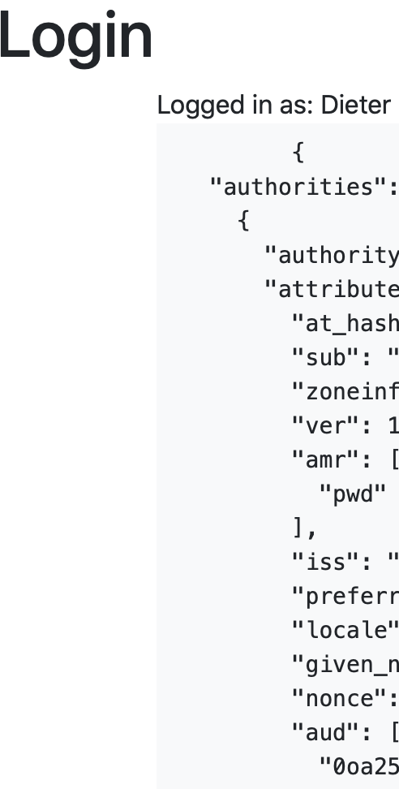

# oidc-spring-security
OIDC Spring Security 5 Example
# oidc-simple
Single Sign-On Application to demonstrate the usage of Spring Boot with Spring Security 5 for the Client ID Endpoints of OIDC Identity Provider. 

The app allows to login (authenticate with OIDC Identity Provider) and to logout. The app presents the details provided by the user info endpoint of the OIDC Identity Provider.



# Prerequisite (example OKTA)
* [create OKTA dev account](https://developer.okta.com/signup/)
    * redirect URL is your APPLICATION ROUTE + /login/oauth2/code/okta (ex.: https://mydomain/login/oauth2/code/okta)

# Quickstart - just use the image on dockerhub
- create a secret with credentials for oauth2 provider.
````bash
kubectl create secret generic credentials --from-literal SPRING_SECURITY_OAUTH2_CLIENT_REGISTRATION_OKTA_SCOPE=openid --from-literal SPRING_SECURITY_OAUTH2_CLIENT_REGISTRATION_OKTA_CLIENT-ID=XXX --from-literal SPRING_SECURITY_OAUTH2_CLIENT_REGISTRATION_OKTA_CLIENT-SECRET=XXX --from-literal SPRING_SECURITY_OAUTH2_CLIENT_PROVIDER_OKTA_ISSUER-URI=https://dev-XXX.okta.com/oauth2/default
````
- optional: edit the proxy settings in deployment.yaml
````bash
kubectl create -f deployment.yaml
````
- deploy to k8s
````bash
kubectl create -f deployment.yaml
````
- port forwarding to localhost if required
````bash
kubectl port-forward svc/oauth2-demo 8080:8080
````
# create and use your own image
- clone this repo
````bash
git clone https://github.com/dflick-pivotal/oidc-spring-security.git
````
- cd into "oidc-spring-security"
````bash
cd oidc-spring-security
````
- run "./mvnw spring-boot:build-image" (linux) or "mvnw.cmd spring-boot:build-image" (windows)
````bash
./mvnw spring-boot:build-image -Dspring-boot.build-image.imageName=XXX/oauth2-demo -DskipTests
````
- push your image to your container registry
````bash
docker push XXXX/oauth2-demo
````


